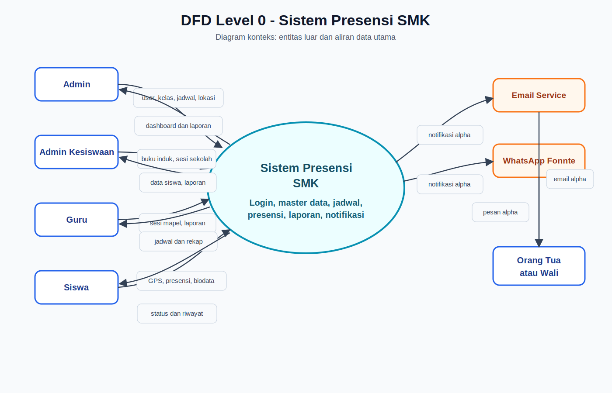
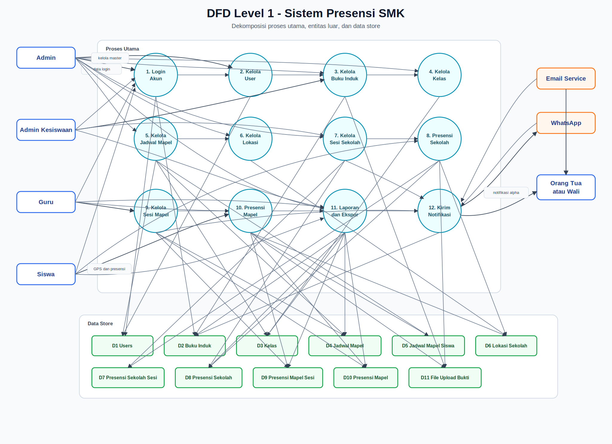
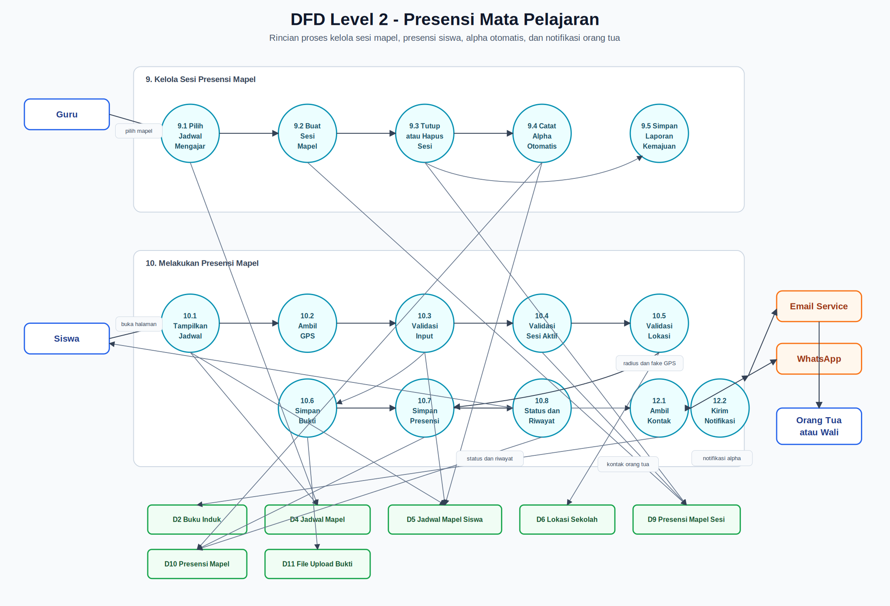
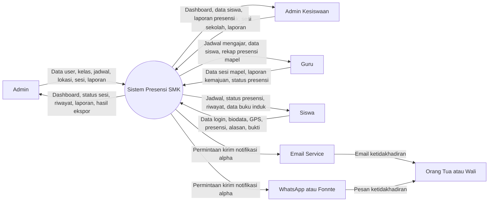
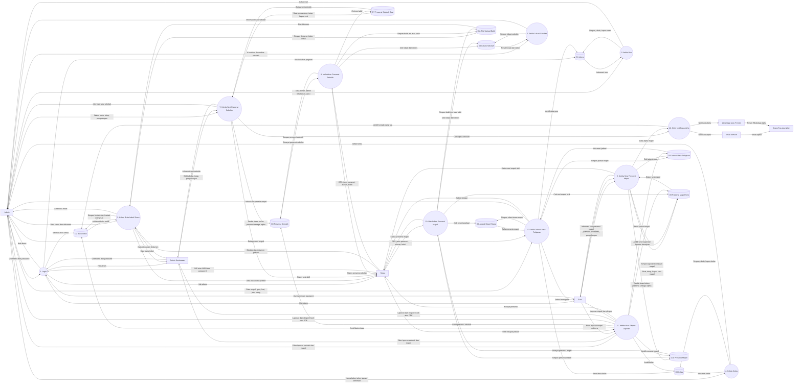
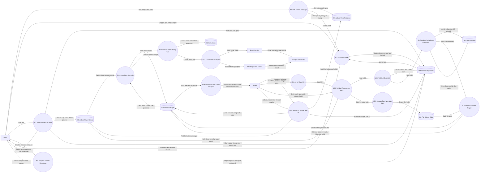

# DFD Sistem Presensi SMK

Dokumen ini berisi DFD Level 0, Level 1, dan Level 2 dalam format Mermaid. Diagram disusun berdasarkan modul yang ada di repository: login, user, buku induk, kelas, jadwal mata pelajaran, lokasi sekolah, presensi sekolah, presensi mata pelajaran, laporan, dan notifikasi alpha.

## File Gambar

- [Gambar DFD Level 0](dfd-level-0.svg)
- [Gambar DFD Level 1](dfd-level-1.svg)
- [Gambar DFD Level 2 Presensi Mapel](dfd-level-2-presensi-mapel.svg)

## DFD Level 0

## DFD Level 1

## DFD Level 2 - Proses Presensi Mata Pelajaran

Diagram ini memecah proses Level 1 nomor 9 dan 10, yaitu pengelolaan sesi presensi mapel oleh guru dan pengisian presensi mapel oleh siswa.

## Keterangan Data Store

- D1 Users: akun admin, admin kesiswaan, dan guru.
- D2 Buku Induk: identitas siswa, akun siswa, kontak orang tua, dan data dokumen.
- D3 Kelas: data kelas, tahun ajaran, dan semester.
- D4 Jadwal Mata Pelajaran: jadwal mapel, guru pengampu, hari, jam, ruang.
- D5 Jadwal Mapel Siswa: relasi siswa dengan jadwal mata pelajaran.
- D6 Lokasi Sekolah: titik koordinat sekolah dan radius presensi.
- D7 Presensi Sekolah Sesi: sesi presensi sekolah.
- D8 Presensi Sekolah: catatan presensi sekolah siswa.
- D9 Presensi Mapel Sesi: sesi presensi mata pelajaran dan laporan kemajuan.
- D10 Presensi Mapel: catatan presensi mata pelajaran siswa.
- D11 File Upload Bukti: file bukti izin, sakit, dan dokumen buku induk di folder upload publik.
