# DFD Level 1 Sistem Presensi SMK Saat Ini

Dokumen ini menyusun ulang DFD Level 1 berdasarkan struktur sistem terbaru di repository. Sistem sekarang memakai master `kelas`, `jadwal_mata_pelajaran`, dan `jadwal_mata_pelajaran_siswa`; presensi mata pelajaran disimpan lewat `presensi_mapel_sesi` dan `presensi_mapel`.

```mermaid
flowchart LR
    %% External entities
    Admin[Admin]
    AK[Admin Kesiswaan]
    Guru[Guru]
    Siswa[Siswa]
    Ortu[Orang Tua / Wali]
    SMTP[Email Service]
    WA[WhatsApp / Fonnte]

    %% Processes
    P1((1. Login))
    P2((2. Kelola User))
    P3((3. Kelola Buku Induk Siswa))
    P4((4. Kelola Kelas))
    P5((5. Kelola Jadwal Mata Pelajaran))
    P6((6. Kelola Lokasi Sekolah))
    P7((7. Kelola Sesi Presensi Sekolah))
    P8((8. Melakukan Presensi Sekolah))
    P9((9. Kelola Sesi Presensi Mapel))
    P10((10. Melakukan Presensi Mapel))
    P11((11. Melihat / Ekspor Laporan))
    P12((12. Kirim Notifikasi Alpha))

    %% Data stores
    D1[(D1 Users)]
    D2[(D2 Buku Induk)]
    D3[(D3 Kelas)]
    D4[(D4 Jadwal Mata Pelajaran)]
    D5[(D5 Jadwal Mapel Siswa)]
    D6[(D6 Lokasi Sekolah)]
    D7[(D7 Presensi Sekolah Sesi)]
    D8[(D8 Presensi Sekolah)]
    D9[(D9 Presensi Mapel Sesi)]
    D10[(D10 Presensi Mapel)]

    %% Login
    Admin -->|username dan password| P1
    AK -->|username dan password| P1
    Guru -->|username dan password| P1
    Siswa -->|NIS/NISN dan password| P1
    P1 -->|validasi akun| D1
    P1 -->|validasi akun siswa| D2
    P1 -->|hak akses sistem| Admin
    P1 -->|hak akses sistem| AK
    P1 -->|hak akses sistem| Guru
    P1 -->|hak akses sistem| Siswa

    %% User management
    Admin -->|data user guru/admin/admin kesiswaan| P2
    P2 -->|simpan, ubah, hapus user| D1
    D1 -->|informasi user| P2
    P2 -->|informasi user| Admin

    %% Buku induk
    Admin -->|data siswa dan dokumen| P3
    AK -->|data siswa dan dokumen| P3
    Siswa -->|pembaruan biodata dan dokumen| P3
    P3 -->|simpan biodata, kontak orang tua, dokumen| D2
    D2 -->|informasi buku induk| P3
    P3 -->|informasi buku induk| Admin
    P3 -->|informasi buku induk| AK
    P3 -->|informasi buku induk pribadi| Siswa

    %% Kelas
    Admin -->|data kelas, tahun ajaran, semester| P4
    P4 -->|simpan, ubah, hapus kelas| D3
    D3 -->|informasi kelas| P4
    P4 -->|informasi kelas| Admin

    %% Jadwal mata pelajaran
    Admin -->|data mapel, guru, hari, jam, ruang| P5
    P5 -->|ambil data guru| D1
    P5 -->|ambil data kelas| D3
    P5 -->|simpan jadwal| D4
    Admin -->|data siswa peserta mapel| P5
    P5 -->|simpan relasi siswa-mapel| D5
    D4 -->|informasi jadwal| P5
    D5 -->|daftar peserta mapel| P5
    P5 -->|jadwal dan peserta mapel| Admin
    P5 -->|jadwal mengajar| Guru
    P5 -->|jadwal belajar| Siswa

    %% Lokasi
    Admin -->|koordinat dan radius sekolah| P6
    P6 -->|simpan lokasi sekolah| D6
    D6 -->|pusat lokasi dan radius presensi| P6
    P6 -->|informasi lokasi sekolah| Admin

    %% School attendance session
    Admin -->|waktu buka, tutup, pengulangan| P7
    AK -->|waktu buka, tutup, pengulangan| P7
    P7 -->|buat, perpanjang, tutup, hapus sesi| D7
    P7 -->|saat tutup: tandai siswa belum presensi sebagai alpha| D8
    D7 -->|status sesi sekolah| P7
    P7 -->|informasi sesi presensi sekolah| Admin
    P7 -->|informasi sesi presensi sekolah| AK
    P7 -->|status sesi aktif| Siswa
    P7 -->|data siswa alpha| P12

    %% Student school attendance
    Siswa -->|lokasi GPS, jenis hadir/izin/sakit, alasan, bukti| P8
    P8 -->|cek sesi aktif| D7
    P8 -->|cek lokasi dan radius| D6
    P8 -->|simpan presensi sekolah| D8
    D8 -->|riwayat presensi sekolah| P8
    P8 -->|status presensi sekolah| Siswa

    %% Subject attendance session
    Guru -->|pilih jadwal, tanggal, pengulangan| P9
    P9 -->|cek jadwal guru| D4
    P9 -->|buat, tutup, hapus sesi mapel| D9
    P9 -->|simpan laporan kemajuan mapel| D9
    P9 -->|saat tutup: tandai siswa belum presensi sebagai alpha| D10
    D9 -->|status sesi mapel| P9
    P9 -->|informasi sesi presensi mapel| Guru
    P9 -->|status sesi mapel aktif| Siswa
    P9 -->|data siswa alpha mapel| P12

    %% Student subject attendance
    Siswa -->|lokasi GPS, jenis hadir/izin/sakit, alasan, bukti| P10
    P10 -->|cek siswa terdaftar pada jadwal| D5
    P10 -->|cek sesi mapel aktif| D9
    P10 -->|cek lokasi dan radius| D6
    P10 -->|simpan presensi mapel| D10
    D10 -->|riwayat presensi mapel| P10
    P10 -->|status presensi mapel| Siswa

    %% Reports
    Admin -->|filter laporan sekolah/mapel| P11
    AK -->|filter laporan sekolah/mapel| P11
    Guru -->|filter laporan mapel miliknya| P11
    Siswa -->|filter riwayat presensi pribadi| P11
    P11 -->|ambil data siswa| D2
    P11 -->|ambil kelas dan jadwal| D3
    P11 -->|ambil jadwal mapel| D4
    P11 -->|ambil presensi sekolah| D8
    P11 -->|ambil sesi mapel dan laporan kemajuan| D9
    P11 -->|ambil presensi mapel| D10
    P11 -->|laporan, riwayat, export Excel/PDF| Admin
    P11 -->|laporan, export Excel/PDF| AK
    P11 -->|laporan mapel, export Excel/PDF| Guru
    P11 -->|riwayat presensi| Siswa

    %% Notifications
    P12 -->|ambil kontak orang tua| D2
    P12 -->|notifikasi ketidakhadiran| SMTP
    P12 -->|notifikasi ketidakhadiran| WA
    SMTP -->|email alpha| Ortu
    WA -->|pesan WhatsApp alpha| Ortu
```

## Daftar Proses Level 1

1. **Login**: memvalidasi akun berdasarkan `users` untuk admin/guru/admin kesiswaan dan `buku_induk` untuk siswa.
2. **Kelola User**: admin mengelola akun admin, admin kesiswaan, dan guru pada `users`.
3. **Kelola Buku Induk Siswa**: admin, admin kesiswaan, dan siswa mengelola data siswa, kontak orang tua, dan dokumen pada `buku_induk`.
4. **Kelola Kelas**: admin mengelola kelas, tahun ajaran, dan semester pada `kelas`.
5. **Kelola Jadwal Mata Pelajaran**: admin mengelola jadwal mapel, guru pengampu, hari, jam, ruang, dan peserta siswa pada `jadwal_mata_pelajaran` serta `jadwal_mata_pelajaran_siswa`.
6. **Kelola Lokasi Sekolah**: admin menyimpan titik koordinat sekolah dan radius validasi pada `lokasi_sekolah`.
7. **Kelola Sesi Presensi Sekolah**: admin atau admin kesiswaan membuat, memperpanjang, menutup, dan menghapus sesi presensi sekolah pada `presensi_sekolah_sesi`.
8. **Melakukan Presensi Sekolah**: siswa melakukan presensi sekolah, sistem memvalidasi GPS dan menyimpan ke `presensi_sekolah`.
9. **Kelola Sesi Presensi Mapel**: guru membuat/menutup/menghapus sesi mapel sesuai jadwal, serta mengisi laporan kemajuan pada `presensi_mapel_sesi`.
10. **Melakukan Presensi Mapel**: siswa melakukan presensi mata pelajaran, sistem mengecek peserta jadwal, sesi aktif, dan lokasi, lalu menyimpan ke `presensi_mapel`.
11. **Melihat / Ekspor Laporan**: admin, admin kesiswaan, guru, dan siswa melihat laporan/riwayat; admin/guru dapat mengekspor Excel atau PDF sesuai hak akses.
12. **Kirim Notifikasi Alpha**: ketika sesi ditutup, siswa yang belum presensi ditandai `alpha`; sistem mengambil kontak orang tua dari `buku_induk` dan mengirim notifikasi melalui email serta WhatsApp/Fonnte.

## Data Store

- **D1 Users**: akun admin, admin kesiswaan, dan guru.
- **D2 Buku Induk**: identitas siswa, kredensial siswa, kontak orang tua, dan dokumen.
- **D3 Kelas**: kelas, tahun ajaran, dan semester.
- **D4 Jadwal Mata Pelajaran**: jadwal mapel, guru pengampu, hari, jam, dan ruang.
- **D5 Jadwal Mapel Siswa**: relasi siswa dengan jadwal mata pelajaran.
- **D6 Lokasi Sekolah**: koordinat sekolah dan radius presensi.
- **D7 Presensi Sekolah Sesi**: sesi presensi sekolah.
- **D8 Presensi Sekolah**: catatan presensi sekolah siswa.
- **D9 Presensi Mapel Sesi**: sesi presensi mata pelajaran dan laporan kemajuan.
- **D10 Presensi Mapel**: catatan presensi mata pelajaran siswa.

